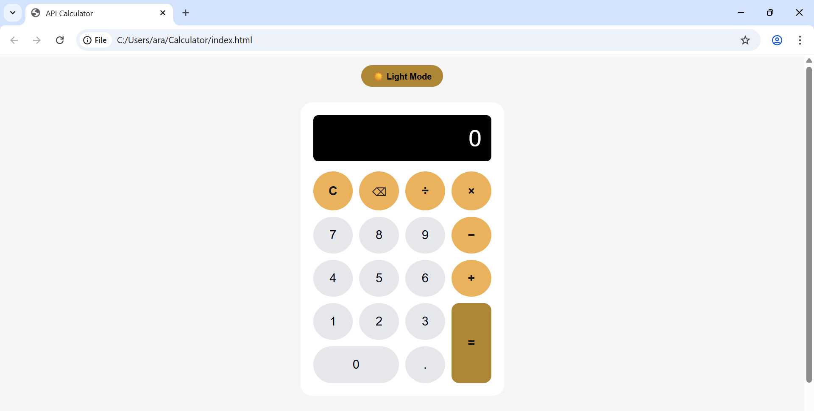

## API Calculator
A lightweight calculator built with HTML, CSS, and JavaScript, powered by the Math.js API. Supports basic arithmetic, dark/light mode, and formatted numbers.

## Features
- Addition, subtraction, multiplication, division
- Clear (`C`) and Backspace (`⌫`) buttons
- Real-time number formatting with commas
- Dark/Light mode toggle
- API-powered calculation with loading and error handling
- Responsive design for desktop and mobile

## How to run the project
This project runs directly in a web browser and does not require any installation or backend server.

## Files
`index.html` – HTML structure
`style.css` – Styling and theme support
`script.js` – Calculator logic and API calls

## API
Endpoint: `https://api.mathjs.org/v4/`
Method: POST
Body: `{ "expr": "2+2" }`
Response: `{ "result": 4 }`

## Screenshots 
Light Mode Screenshots 
Dark Mode Screenshots .png>)

## License
MIT License

Notes:
- An internet connection is required for the Math.js API to process calculations.
- Dark/Light mode and number formatting work offline, but calculations depend on the API.
